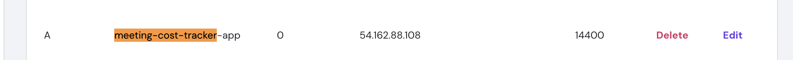

# Deployment Guide - Ubuntu Server (Frontend + Backend on Same Domain)

---

## Step 1: Initial Server Setup

```bash
# Update system
sudo apt update && sudo apt upgrade -y

# Install Node.js 20.x
curl -fsSL https://deb.nodesource.com/setup_20.x | sudo -E bash -
sudo apt install nodejs

# Verify installation
node --version
npm --version

---

## Step 2: Setup SSH Key for GitHub

```bash
# Generate SSH key
ssh-keygen -t ed25519

# Display public key (add this to GitHub -> Settings -> SSH Keys)
cat ~/.ssh/id_ed25519.pub

# Test GitHub connection
ssh -T git@github.com
```

---

## Step 3: Setup Project Directory

```bash
# Set permissions for project directory
sudo chown ubuntu:ubuntu /srv
cd /srv

# Clone the repository
git clone git@github.com:dealzforest/meetingcost.git meetingcost
cd meetingcost
```

---

## Step 4: Install Azure Functions Core Tools

```bash
# Install Microsoft package repository
wget -q https://packages.microsoft.com/config/ubuntu/20.04/packages-microsoft-prod.deb
sudo dpkg -i packages-microsoft-prod.deb
sudo apt-get update

# Install Azure Functions Core Tools
sudo apt-get install azure-functions-core-tools-4

# Verify installation
func --version
```

---

## Step 5: Setup Backend

```bash
# Navigate to backend directory
cd /srv/meetingcost/backend

# Install dependencies
npm install

# Test Azure Functions locally
func start --host 0.0.0.0 --port 7071
# Press Ctrl+C after testing
```

---

## Step 6: Setup Frontend

```bash
# Navigate to frontend directory
cd /srv/meetingcost/frontend

# Install dependencies
npm install

# Run preview server locally
npm run preview -- --host 0.0.0.0 --port 3000
# Press Ctrl+C after testing
```

---

## Step 7: Install and Configure PM2

```bash
# Install PM2 globally
sudo npm install -g pm2

# Start backend with PM2
cd /srv/meetingcost/backend
pm2 start func --name "backend" -- start --host 0.0.0.0 --port 7071

# Start frontend with PM2
cd /srv/meetingcost/frontend
# Create .env 
sudo vi .env
```
VITE_API_BASE_URL=https://meeting-cost-tracker.accesspearl.in/api
ALLOWED_HOSTS="meeting-cost-tracker.accesspearl.in"

```bash
# click "i" to start the edit mode
# update the VITE_API_BASE_URL and ALLOWED_HOSTS
# click esc
# :wq!

# Create pm2 for frontend
pm2 start "dotenv -e .env npm run preview -- --host 0.0.0.0 --port 3000" --name frontend

# Check status
pm2 status

# Save PM2 configuration
pm2 save

# Setup PM2 to start on boot
pm2 startup
# Run the command it suggests, e.g.:
# sudo env PATH=$PATH:/usr/bin pm2 startup ubuntu -u ubuntu --hp /home/ubuntu
```

---

## Step 8: Install and Configure Nginx

```bash
# Install Nginx
sudo apt install -y nginx
```

### Single Domain Nginx Config

```bash
sudo nano /etc/nginx/sites-available/meetingcost
```

```nginx
server {
    server_name meeting-cost-tracker.accesspearl.in;

    # Frontend
    location / {
        proxy_pass http://localhost:3000;
        proxy_http_version 1.1;
        proxy_set_header Host $host;
        proxy_set_header X-Real-IP $remote_addr;
        proxy_set_header X-Forwarded-For $proxy_add_x_forwarded_for;
        proxy_set_header X-Forwarded-Proto $scheme;
    }

    # Backend API
    location /api {
        proxy_pass http://localhost:7071;
    }
}
```

### Enable Site

```bash
sudo ln -sf /etc/nginx/sites-available/meetingcost /etc/nginx/sites-enabled/

# Remove default config
sudo rm -f /etc/nginx/sites-enabled/default

# Test nginx configuration
sudo nginx -t

# Restart nginx
sudo systemctl restart nginx
sudo systemctl enable nginx
```

### Enable SSL (Certbot)

```bash
sudo apt update
sudo apt install certbot python3-certbot-nginx -y
sudo certbot --nginx -d meeting-cost-tracker.accesspearl.in
```

## Step 8.5 How to Point Your Domain to Your Server IP

1. **Log in to your domain registrar**
   (e.g., GoDaddy, Namecheap, Google Domains, etc.)

2. **Locate DNS / Nameserver settings**
   Usually under **DNS Management**, **Domain Settings**, or **Advanced DNS**.

3. **Option 1: Use A Record**
   This is the simplest way to point the domain to a server IP:

   * Add an **A Record** for your domain:

     | Type | Host | Value (IP)         | TTL  |
     | ---- | ---- | ------------------ | ---- |
     | A    | @    | `<your_server_IP>` | 14400 |


4. **Option 2: Use Child Nameservers (if registrar allows it)**
   Similar to your screenshot:

   * Create a **child nameserver** like `app.<your_domain>` and point it to your server’s IP.
   * Then, at the registrar, set your domain to use the custom nameservers.

   
   

6. **Verify setup**

   ```bash
   nslookup <your_domain>
   ping <your_domain>
   ```

   You should see your server’s IP in the response.

---

### Notes

* Using **A Record** is simpler.
* Using **child nameservers** is only necessary if you want to manage custom subdomains extensively.(recommended)
* Make sure the **server firewall allows HTTP/HTTPS (80/443)** traffic.

---

## Step 9: Verify Deployment

```bash
# Check PM2 services
pm2 status

# Check Nginx
sudo systemctl status nginx

# Test API endpoints
curl https://<your_domain>/api/meeting/123
```

---

## Step 10: Update AWS Security Group

Go to the **AWS EC2 Console**:

1. Navigate to **EC2 → Instances** and select your instance.
2. Under the **Security tab**, find the **Security Group** attached to your instance.
3. Click **Edit inbound rules**.
4. Add the following rules:

   * **SSH**: TCP, Port `22`, Source = Your IP (recommended)
   * **HTTP**: TCP, Port `80`, Source = 0.0.0.0/0
   * **HTTPS**: TCP, Port `443`, Source = 0.0.0.0/0

   

---

## Step 11: Create Azure App Registration

1. Go to the [Azure Portal](https://portal.azure.com/).
2. Navigate to **Azure Active Directory → App registrations → New registration**.
3. Fill in the details:

   * **Name**: `Meeting-Cost-Tracker-v2`
   * **Supported account types**:
     ✅ Accounts in any organizational directory (Any Microsoft Entra ID tenant – Multitenant) **and** personal Microsoft accounts
4. Click **Register**.

Once created, note down:

* **Application (client) ID**

---

## Step 12: Create Microsoft Teams App in Developer Portal

1. Go to the [Microsoft Teams Developer Portal](https://dev.teams.microsoft.com/).
2. In the left menu, go to **Apps → + New app**.
3. Enter the following details:

   * **Name**: `Meeting Cost Tracker V2`
   * Click **Create**.

---

### Update App Manifest

1. Go to your app → **Configuration → App manifest editor**.
2. Update the manifest JSON with your values:

```json
"developer": {
  "name": "<developer name>",
  "mpnId": "",
  "websiteUrl": "<frontend_url>",
  "privacyUrl": "<frontend_url>/privacy",
  "termsOfUseUrl": "<frontend_url>/terms"
},
"configurableTabs": [
  {
    "configurationUrl": "https://meeting-cost-tracker-app.accesspearl.in/config",
    "canUpdateConfiguration": true,
    "scopes": [
      "team",
      "groupChat"
    ],
    "context": [
      "meetingSidePanel"
    ]
  }
],
"validDomains": [
  "<frontend_domain>"
],
"webApplicationInfo": {
  "id": "<Azure_app_client_id>"
}
```

Replace:

* `<developer name>` → Your company/team name
* `<frontend_url>` → Your deployed frontend domain (e.g., `<your_domain>`)
* `<frontend_domain>` → Your domain only (e.g., `<your_domain>`)
* `<Azure_app_client_id>` → The **Client ID** from the Azure App Registration

---

### Test and Publish

1. In the Developer Portal, click **Preview in Teams** to test the app inside your Teams client.
2. Once verified, you can **Publish** the app to your organization’s Teams app store.

---

## API Endpoints

* **Get Meeting Data**: `https://<your_domain>/api/meeting`
* **Join Meeting**: `https://<your_domain>/api/joinMeeting`
* **Update Rate**: `https://<your_domain>/api/updateRate`

---

## ✅ Success Criteria

* PM2 shows **backend + frontend** running
* Frontend accessible at `https://<your_domain>`
* Backend API accessible at `https://<your_domain>/api/...`
* Security group allows **22, 80, 443 only**
* Services restart automatically after reboot
* Teams app loads correctly with Azure AD authentication
